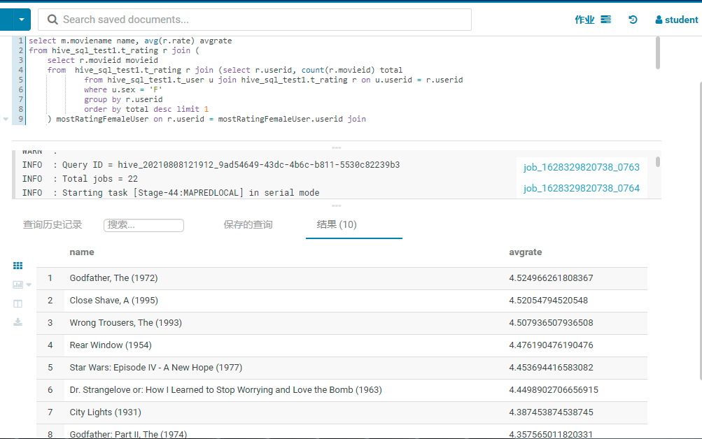

# hive sql 作业


## 题一

展示电影ID为2116这部电影各年龄段的平均影评分


### sql 代码

``` sql
select u.age age, avg(r.rate) avgrate
from hive_sql_test1.t_rating r join hive_sql_test1.t_user u on r.userid = u.userid  
where movieid = 2116
group by u.age
```

### sql要点

使用group by 子句后，select只同包含group by 子句用到的column name以及聚合函数；


## 题二

找出男性评分最高且评分次数超过50次的10部电影，展示电影名，平均影评分和评分次数


### sql 代码

``` sql
select 'M' as sex, m.moviename name, avg(r.rate) avgrate, count(r.movieid) total
from hive_sql_test1.t_user u join hive_sql_test1.t_rating r on u.userid = r.userid join 
    hive_sql_test1.t_movie m on m.movieid = r.movieid
where u.sex = 'M'
group by r.movieid, m.moviename having total > 50
order by avgrate desc limit 10;
```

### sql 要点

* select  子句中'M' as sex表示sex列的默认值都'M'；
* group by 子句中使用了m.moviename列的前提是：每个movieid只有一个moviename；
* having 子句对group by 子句执行后的聚合值进行过滤；
* order by avgrate desc表示结果集 平均评分从高到低排序


## 题三

找出影评次数最多的女士所给出最高分的10部电影的平均影评分，展示电影名和平均影评分（可使用多行SQL）

### 需求分析

找出特定要求的10部电影平均影评分和它们的电影名，特定要求如下

* 特定userid：影评次数最多的女士；
* 特定movieid：影评次数最多的女士所给出最高分的10部电影；
  * 由于存在并列最高分的情况，所以该女士影评分数与最高分的10部电影的影评分数相同的都符合条件；




### sql 代码

``` sql
select m.moviename name, avg(r.rate) avgrate
from hive_sql_test1.t_rating r join (
	select r.movieid movieid
	from  hive_sql_test1.t_rating r join (select r.userid, count(r.movieid) total
			from hive_sql_test1.t_user u join hive_sql_test1.t_rating r on u.userid = r.userid
			where u.sex = 'F'
			group by r.userid
			order by total desc limit 1
	) mostRatingFemaleUser on r.userid = mostRatingFemaleUser.userid join
		(select ratingGrade.maxrate rate 
			from (select max(r.rate) maxrate
				from (select r.userid, count(r.movieid) total
						from hive_sql_test1.t_user u join hive_sql_test1.t_rating r on u.userid = r.userid
						where u.sex = 'F'
						group by r.userid
						order by total desc limit 1
					) mostRatingFemale join hive_sql_test1.t_rating r on mostRatingFemale.userid = r.userid
				group by r.movieid
				order by maxrate desc limit 10) ratingGrade
			group by ratingGrade.maxrate
	) maxrates on r.rate = maxrates.rate
) filterMovie on r.movieid = filterMovie.movieid join hive_sql_test1.t_movie m on r.movieid = m.movieid
group by r.movieid, m.moviename
order by avgrate desc limit 10;
```

### sql 要点

* hive_sql_test1.t_rating为主表：匹配特定userid和匹配特定movieid；
* 匹配特定userid的表别名为：mostRatingFemaleUser；
* 匹配特定movieid的表别名为：maxrates；

### 结果验证

用结果输出的10个moviename、影评次数最多的女士、影评最高等级"5"(一共有59个rate值为5的movieid)的三个条件来验证


#### sql 代码

``` sql
select r.userid, m.moviename, r.rate
	from (select r.userid, count(r.movieid) total
		from hive_sql_test1.t_user u join hive_sql_test1.t_rating r on u.userid = r.userid
		where u.sex = 'F'
		group by r.userid
		order by total desc limit 1
	) u join hive_sql_test1.t_rating r on u.userid = r.userid join 
	    hive_sql_test1.t_movie m on m.movieid = r.movieid
	where m.moviename in(    
		"Godfather, The (1972)",
		"Close Shave, A (1995)",
		"Wrong Trousers, The (1993)",
		"Rear Window (1954)",
		"Star Wars: Episode IV - A New Hope (1977)",
		"Dr. Strangelove or: How I Learned to Stop Worrying and Love the Bomb (1963)",
		"City Lights (1931)",
		"Godfather: Part II, The (1974)",
		"Creature Comforts (1990)",
		"Some Like It Hot (1959)"
	) and r.rate = 5;
```

#### 验证思路

查证“结果输出的10个moviename”是否符合：影评次数最多的女士、评分为该女士评分最高的10部电影对应的不同评分列表。且该评分列表只有一个值，即"5"


